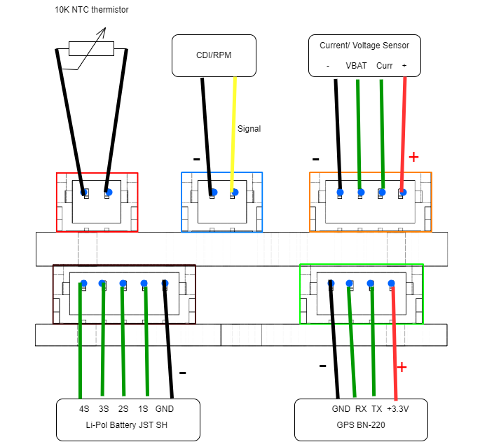

# PCB Stack for oXSensors

This PCB design focuses on creating a minimalistic and efficient PCB stack for OpenXSensor project  https://github.com/mstrens/oXs_on_RP2040 , incorporating essential features such as Li-PoL  individuall cell measurement, temperature measurement using NTC, and seamless integration with external GPS modules and on-board BMP280.

This version incorporates temperature measurement using a 10K NTC thermistor, which is not originally accounted for in the [firmware](https://github.com/mstrens/oXs_on_RP2040). Therefore, a minor code addition and code compiling is necessary.

The PCB stack can be powered by standard 5V or can handle up to 12V by configuring the solder pads. This can be useful when operating high-voltage (HV) servos at 8.4V.

**Top PCB Connectors**:

- NTC 10K Thermistor
- RPM -> to CDI
- ACS758 Current Sensor and Voltage measurement

**Bottom PCB Connectors:**

- Li-Pol Cells Measurement (up to 4S) connected to on-board ADS1115
- GPS Module - e.g. BN-220
- ACS758 Current Sensor and Voltage measurement

**PCB Stack Connectors:**

Wiring and assembly instructions can be found in https://github.com/CodeWorksCZ/PCB-Stack-for-oXSensors/wiki

The initial version lacks the capability to connect additional I2C devices.

**Wiring diagram**

Precompiled firmware with the temperature calculation  based on NTC thermistor values can be [here](/oXs%20Firmware/).
