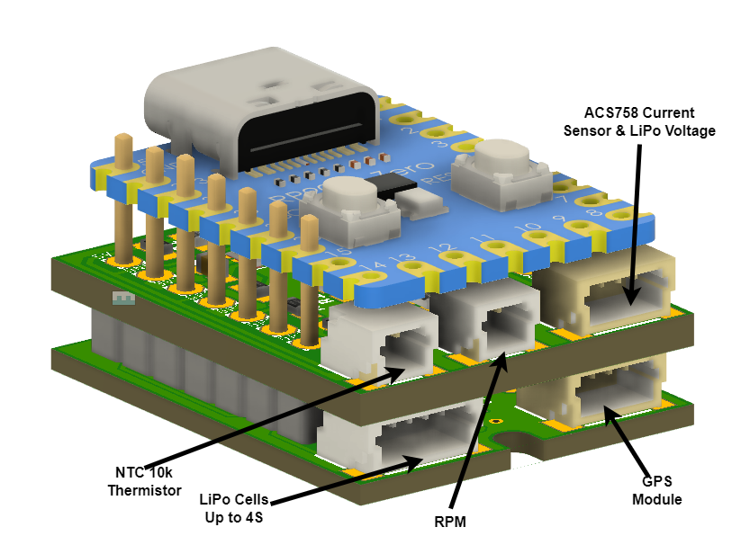

# PCB Stack for oXSensors
This PCB design focuses on creating a minimalistic and efficient PCB stack for OpenXSensor project  https://github.com/mstrens/oXs_on_RP2040 , incorporating essential features such as Lipo Cell measurement, temperature measurement using NTC, and seamless integration with external GPS modules.

Top PCB Connectors:
- NTC 10K Thermistor
- RPM -> to CDI
- ACS758 Current Sensor and Voltage measurement

Bottom PCB Connectors:
- Lipo Cells Measurement
- GPS Module
- ACS758 Current Sensor and VOltage measurement

PCB Stack Connectors:

